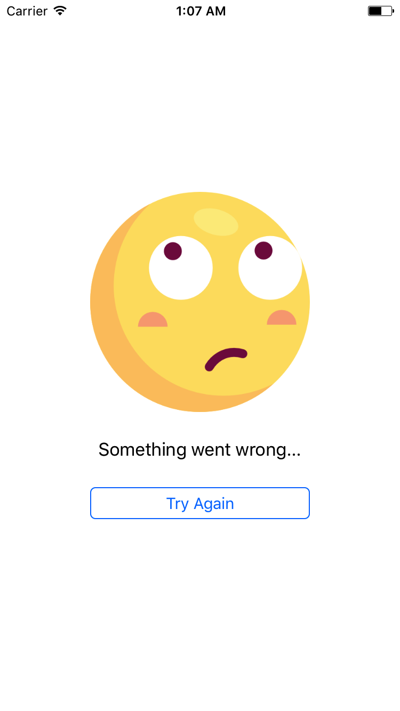

# AZEmptyState
Making empty state simple.

## Screenshots
     

## Installation


### Cocoa Pods:

```bash
pod 'AZEmptyState'
```

### Manual:

Simply drag and drop the ```Sources``` folder to your project.

## Usage:

### Using Interface Builder:


### Programmatically:

```swift
//init var
emptyStateView = AZEmptyStateView()

//customize
emptyStateView.image = #imageLiteral(resourceName: "thinking")
emptyStateView.message = "Something went wrong..."
emptyStateView.buttonText = "Try Again"
emptyStateView.addTarget(self, action: #selector(tryAgain), for: .touchUpInside)

//add subview
view.addSubview(emptyStateView)

//add autolayout
emptyStateView.translatesAutoresizingMaskIntoConstraints = false
emptyStateView.centerXAnchor.constraint(equalTo: view.centerXAnchor).isActive = true
emptyStateView.centerYAnchor.constraint(equalTo: view.centerYAnchor).isActive = true
emptyStateView.widthAnchor.constraint(equalTo: view.widthAnchor, multiplier: 0.6).isActive = true
emptyStateView.heightAnchor.constraint(equalTo: view.heightAnchor, multiplier: 0.55).isActive = true
```

## Sub Classing

Here is an example of sub-classing:

```swift
@IBDesignable
class MyEmptyStateView: AZEmptyStateView{

    //Use image with content mode of `scale aspect fit`
    override func setupImage() -> UIImageView {
        let imageView = UIImageView()
        imageView.contentMode = .scaleAspectFit
        return imageView
    }

    //Use the default label with extra modifications, such as different font and different color.
    override func setupLabel() -> UILabel {
        let label = super.setupLabel()
        label.font = UIFont(name: "Helvetica-Light", size: 16)
        label.numberOfLines = 0
        label.textColor = .white
        return label
    }

    //use a custom subclass of UIButton
    override func setupButton() -> UIButton {
        return HighlightableButton()
    }

    //setup the stack view to your liking
    override func setupStack(_ imageView: UIImageView, _ textLabel: UILabel, _ button: UIButton) -> UIStackView {
        let stack = super.setupStack(imageView, textLabel, button)
        stack.spacing = 14
        stack.alignment = .center
        button.widthAnchor.constraint(equalTo: stack.widthAnchor, multiplier: 0.8).isActive = true
        imageView.widthAnchor.constraint(equalTo: stack.widthAnchor, multiplier: 0.5).isActive = true
        return stack
    }
}
```

